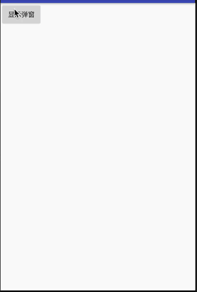
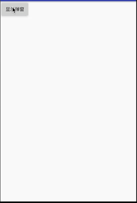
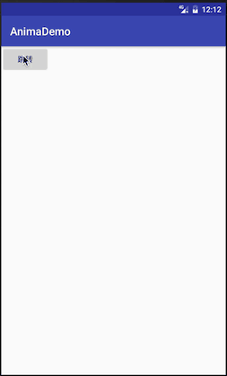
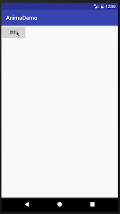

# View 动画几种特殊使用场景

View 动画的一个特点就是，他的动画仅仅是动的 View 的绘制地方，View 真正的位置并没有一起动画。  
View 除了会用作[直接作用页面中的 View ](https://github.com/OCNYang/Android-Animation-Set/tree/master/view-animation)外，通常还用用在下面一些地方。

## 使用在 PopupWindow 上

### 原效果

先做一个 PopupWindow, 这个 PopupWindow 的 View 只有一个背景图片，一只大猫。：

    private void initWindow() {
            View view = new View(this);
            view.setBackground(getDrawable(R.drawable.xiaomao));
            popupWindow = new PopupWindow(view, ViewGroup.LayoutParams.WRAP_CONTENT, ViewGroup.LayoutParams.WRAP_CONTENT);
        }

然后给按钮的点击事件设置为显示 PopupWindow：

    btnRun.setOnClickListener(new View.OnClickListener() {
                @Override
                public void onClick(View v) {
                    if (popupWindow.isShowing()) {
                        popupWindow.dismiss();
                    } else {
                        popupWindow.showAsDropDown(btnRun);
                    }
                }
            });

这时的效果是这样的：  

### 加动画

那么现在加上一个动画，首先要定义动画。

进入的动画：

    <set xmlns:android="http://schemas.android.com/apk/res/android">
        <translate
            android:fromXDelta="0"
            android:toXDelta="0"
            android:fromYDelta="100%"
            android:toYDelta="0"
            android:duration="2000" />
        <alpha
            android:fromAlpha="0"
            android:toAlpha="1"
            android:duration="2000"
            />
    </set>

消失的动画：

    <set xmlns:android="http://schemas.android.com/apk/res/android">
        <translate
            android:fromXDelta="0"
            android:toXDelta="0"
            android:fromYDelta="0"
            android:toYDelta="100%"
            android:duration="2000" />
        <alpha
            android:fromAlpha="1"
            android:toAlpha="0"
            android:duration="2000"
            />
    </set>

做成一个 `style`, 在 `res/values/styles.xml` 文件里加上：

    

**设置动画**  
这一步就很简单，就加一行代码

    private void initWindow() {
            View view = new View(this);
            view.setBackground(getDrawable(R.drawable.xiaomao));
            popupWindow = new PopupWindow(view, ViewGroup.LayoutParams.WRAP_CONTENT, ViewGroup.LayoutParams.WRAP_CONTENT);
            popupWindow.setAnimationStyle(R.style.pop_anim);
        }

这时效果就成下面那样了： 

## Activity 过场动画

### 通过 overridePendingTransition
  
这种方法写着简单但是不好用，通过 `overridePendingTransition`，他的两个参数分别是新 `Activity` 进入时的动画和旧 Activity 退出时的动画. 如果设置为 0 则没有动画。

这个方法必须跟在 `startActivity()` 或 `finish()` 后面才会生效。

还是先定义两个动画：

进入时的动画：

    <set xmlns:android="http://schemas.android.com/apk/res/android">
        <translate
            android:fromXDelta="0"
            android:toXDelta="0"
            android:fromYDelta="100%"
            android:toYDelta="0"
            android:duration="2000" />
        <alpha
            android:fromAlpha="0"
            android:toAlpha="1"
            android:duration="2000"
            />
    </set>

退出时的动画:

    <set xmlns:android="http://schemas.android.com/apk/res/android">
        <translate
            android:fromXDelta="0"
            android:toXDelta="0"
            android:fromYDelta="0"
            android:toYDelta="-100%"
            android:duration="2000" />
        <alpha
            android:fromAlpha="1"
            android:toAlpha="0"
            android:duration="2000"
            />
    </set>

跳转时调用：

    startActivity(new Intent(MainActivity.this,SecondActivity.class));
    overridePendingTransition(R.anim.activity_in,R.anim.activity_out);

效果： 

### 通过 style

首先看 `res/values/styles.xml`。定义了一个叫 `ActivityAnim` 的 `style`，里面有四个属性，分表代表下面的含义

| 属性 |	含义 |
| ---- | ------ |
| activityOpenEnterAnimation | 打开一个新的 Activity 时，要显示的新的 Activit 执行的动画 |
| activityOpenExitAnimation | 打开一个新的 Activity 时，当前的旧的 Activit 执行的动画 |
| activityCloseEnterAnimation | 关闭一个 activity 时，要显示的上一个 Activity 执行的动画 |
| activityCloseExitAnimation | 关闭一个 activity 时，被关闭的 Activity 执行的动画 |

这四个动画可以针对需要只设置需要的。

把 ActivityAnim 设置给 App 要用的主题 AppTheme 的 `android:windowAnimationStyle` 属性

    <resources>
        
        
    </resources>

在后再清单文件里引用这个主题:

    <manifest xmlns:android="http://schemas.android.com/apk/res/android"
        package="com.sunlinlin.animademo">
        <application
            android:allowBackup="true"
            android:icon="@mipmap/ic_launcher"
            android:label="@string/app_name"
            android:roundIcon="@mipmap/ic_launcher_round"
            android:supportsRtl="true"
            android:theme="@style/AppTheme">
            <activity android:name=".MainActivity">
                <intent-filter>
                    <action android:name="android.intent.action.MAIN" />
                    <category android:name="android.intent.category.LAUNCHER" />
                </intent-filter>
            </activity>
            <activity android:name=".SecondActivity"></activity>
        </application>
    </manifest>

上面的四个动画分别是：

activity_in：

    <set xmlns:android="http://schemas.android.com/apk/res/android">
        <translate
            android:fromXDelta="0"
            android:toXDelta="0"
            android:fromYDelta="100%"
            android:toYDelta="0"
            android:duration="2000" />
        <alpha
            android:fromAlpha="0"
            android:toAlpha="1"
            android:duration="2000" />
    </set>

activity_out:

    <set xmlns:android="http://schemas.android.com/apk/res/android">
        <translate
            android:fromXDelta="0"
            android:toXDelta="0"
            android:fromYDelta="0"
            android:toYDelta="-100%"
            android:duration="2000" />
        <alpha
            android:fromAlpha="1"
            android:toAlpha="0"
            android:duration="2000" />
    </set>

activity_close_in:

    <set xmlns:android="http://schemas.android.com/apk/res/android">
        <translate
            android:fromXDelta="0"
            android:toXDelta="0"
            android:fromYDelta="-100%"
            android:toYDelta="0"
            android:duration="2000" />
        <alpha
            android:fromAlpha="0"
            android:toAlpha="1"
            android:duration="2000" />
    </set>

activity_close_out:

    <set xmlns:android="http://schemas.android.com/apk/res/android">
        <translate
            android:fromXDelta="0"
            android:toXDelta="0"
            android:fromYDelta="0"
            android:toYDelta="100%"
            android:duration="2000" />
        <alpha
            android:fromAlpha="1"
            android:toAlpha="0"
            android:duration="2000" />
    </set>

最终的效果是：
 

实现 Activity 转场的动画有很多种方式，更多方式可以查看 [WiKi:实现 Activity 的切换动画](https://github.com/OCNYang/Android-Animation-Set/wiki/%E5%AE%9E%E7%8E%B0-Activity-%E7%9A%84%E5%88%87%E6%8D%A2%E5%8A%A8%E7%94%BB)

## 给 ViewGroup 的子控件加进场动画

LayoutAnimation 是作用于 ViewGroup 的，用来指定 ViewGroup 的子控件出现的动画

先做一个子控件出现的动画, 从之前随便选个 `activity_in.xml`：

    <set xmlns:android="http://schemas.android.com/apk/res/android">
        <translate
            android:fromXDelta="0"
            android:toXDelta="0"
            android:fromYDelta="100%"
            android:toYDelta="0"
            android:duration="2000" />
        <alpha
            android:fromAlpha="0"
            android:toAlpha="1"
            android:duration="2000" />
    </set>

准备好了动画，接下来有两种方法，也是 xml 和 java

### 通过 XML

然后新建一个动画文件, 这里叫anim_layout.xml, 这里有三个属性：

| 属性 | 作用 |
| ---- | ----- |
| android:delay | 可以取值为数值，百分数，或百分数 p。表示两个子控件执行出场动画的间隔时间，为 0 时，所有控件的动画没有延迟全部开始执行；为 1 时表示等上一个控件动画执行完毕才开始执行下一个；为 0.5 时表示等上一个控件动画执行一半开始执行下一个。可以大于 1。。。当这个值为百分数时，如 50%，表示这个延迟时间是当前动画执行时间的 50%。。。当这个值是百分数 p 的时候，如 50%p, 表示这个延迟时间是父 View 的动画时间的 50%。 |
| android:animationOrder | 有三个值：：normal 表示按正常顺序出现。random 表示乱序出现。reverse 表示反序出现。 |
| android:animation | 指定出现时要执行的动画 |

`anim_layout.xml` 文件代码, 设置上一个动画执行五分之一时开始下一个动画，倒序执行：

    <layoutAnimation xmlns:android="http://schemas.android.com/apk/res/android"
        android:delay="0.2"
        android:animationOrder="reverse"
        android:animation="@anim/activity_in">
    </layoutAnimation>

然后在 Activity 的布局文件中，将一个 LinearLayout 通过 `android:layoutAnimation` 加上了这个动画：

    <LinearLayout
        android:id="@+id/ll"
        android:layout_width="match_parent"
        android:layout_height="match_parent"
        android:layout_below="@+id/btn_back"
        android:layoutAnimation="@anim/anim_layout"
        android:orientation="vertical">
        <Button
            android:layout_width="match_parent"
            android:layout_height="wrap_content"
            android:text="哈哈" />
        ...
    </LinearLayout>

然后进入这个 Activity 时就会看到这个效果： 

### 通过 java

这里不需要建新的文件了。觉得比上面的方便许多，效果跟上图是一样的。

    ll = (LinearLayout) findViewById(R.id.ll);
    Animation animation = AnimationUtils.loadAnimation(this,R.anim.activity_in);
    LayoutAnimationController controller = new LayoutAnimationController(animation);
    controller.setDelay(0.2f);
    controller.setOrder(LayoutAnimationController.ORDER_REVERSE);
    ll.setLayoutAnimation(controller);
    
### 更多

LayoutAnimation 适用于所有的 ViewGroup ，自然也包含 ListView、RecyclerView 等控件。上面说过 LayoutAnimation 提供的是进场动画
效果，所以只在 ViewGroup 第一次加载子 View 时显示一次，所以列表控件的 item 加载动画我们一般不使用它，我们会使用 列表 专门的 Item 加载动画，
比如 `recyclerView.setItemAnimator()` 等方式。

> [原文地址：https://blog.csdn.net/qq_25806863/article/details/70172818](https://blog.csdn.net/qq_25806863/article/details/70172818)